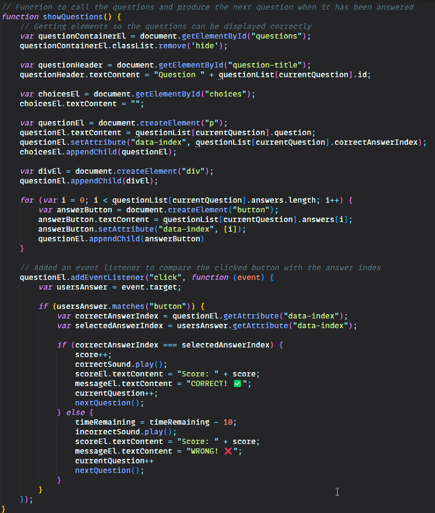

# Code Quiz
Week 6's bootcamp challenge was the first time we were using multiple JavaScript scripts and using the DOM to create/manipulate elements to render interactive pages. As with previous challenges, the HTML and CSS was provided to us, so we could concentrate solely on the JavaScript. In future iterations I would like to play around with the code to make it more interactive and more my style.

## Acceptance Criteria
The acceptancee criteria for this project was as follows:

* A start button that when clicked a timer starts and the first question appears.
 
  * Questions contain buttons for each answer.
  * 
  * When answer is clicked, the next question appears
  * 
  * If the answer clicked was incorrect then subtract time from the clock

* The quiz should end when all questions are answered or the timer reaches 0.

  * When the game ends, it should display their score and give the user the ability to save their initials and their score
  
## Learning Points
This was a little easier than the Password Generator, once I had broken down what I wanted to do it was a case of coding it and putting it all together. 

I found traversing the DOM and being able to create elements via JavaScript a lot easier than I first thought I would and altogether it was a fun project.

## Useful Information
The page is deployed on GitHub - [Click here](https://rbrd87.github.io/code-quiz)

The repository of the project is also hosted on GitHub - [Click here](https://github.com/rbrd87/code-quiz)

## Demo / Screenshots
Here is a demonstration of my code quiz

And here is a small snippet of my JavaScript code
